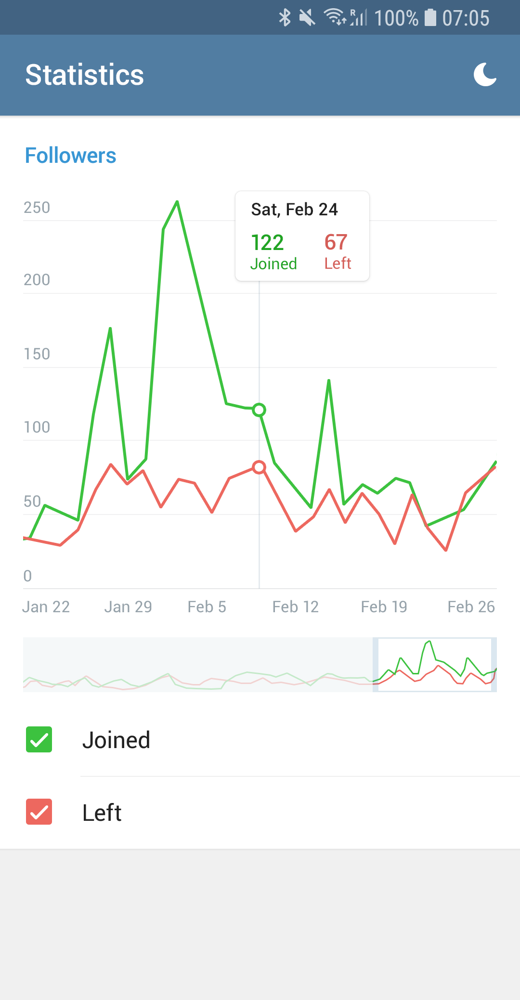
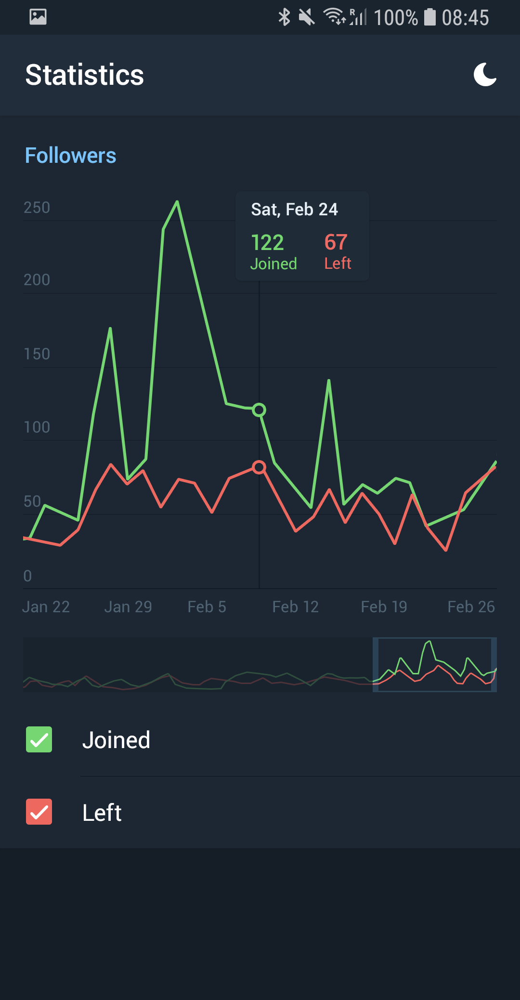
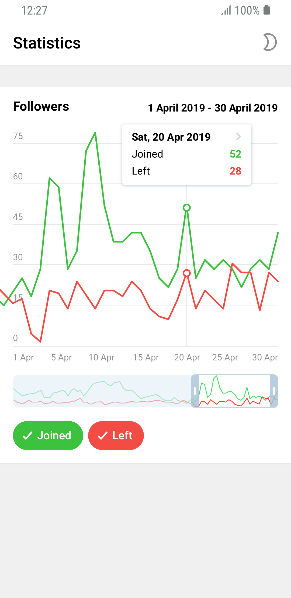
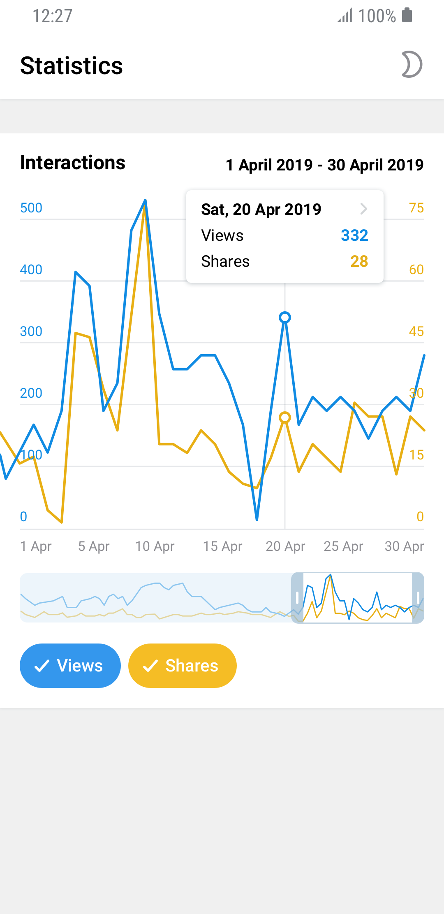
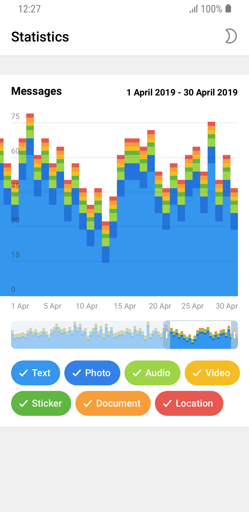
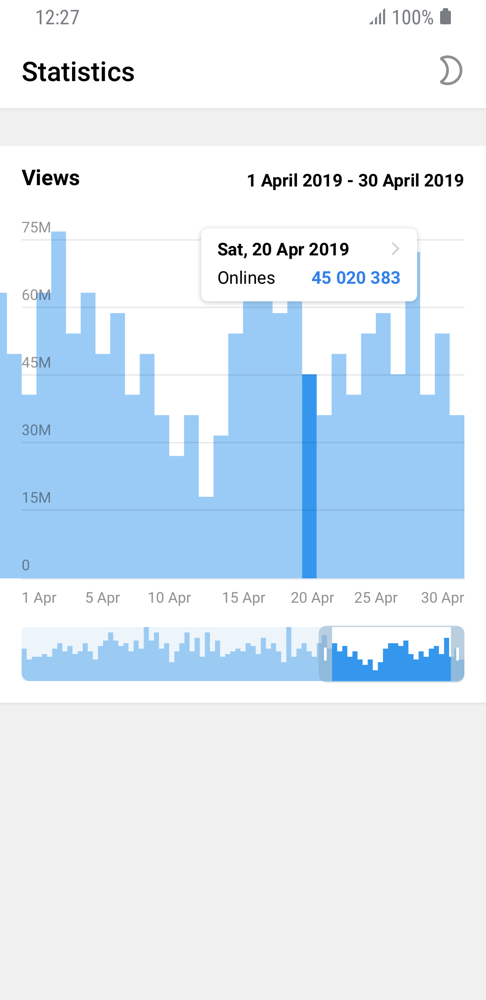
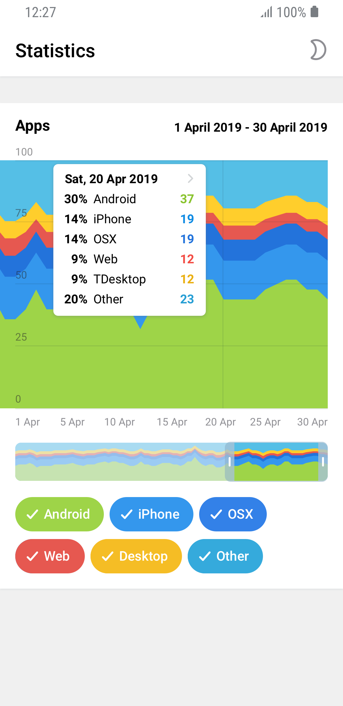

# Android Chart Competition

## Task

The goal of this contest is to develop software for showing charts based on provided input data. Contestants were not allowed to use specialized charting libraries.

### Stage 1 mockups

<p align="center">
  
  
</p>

### Stage 2 mockups

<p align="center">
  
  
  
  
  
</p>

## Result

### Issues from judges on [Stage 1](1)

```
К сожалению, приложение не полностью соответствует рекомендованному дизайну, в особенности в том, что касается плашки с данными о выбранной точке. Активная зона кнопок в фильтрах ограничена чекбоксами. Низкая скорость работы приложения на Samsung Galaxy S5.

Крайние значения дат обрезаются на графиках.
```

### Issues from judges on [Stage 2](2)

```
– Overall poor performance.
– The app is slow when filtering, scaling and scrolling graphs.
– The data resets when changing themes.

Slow when filtering graph #3.

Horizontal scrolling is applied with noticeable lag.
```

[1]: releases/tag/Stage_1
[2]: releases/tag/Stage_2
